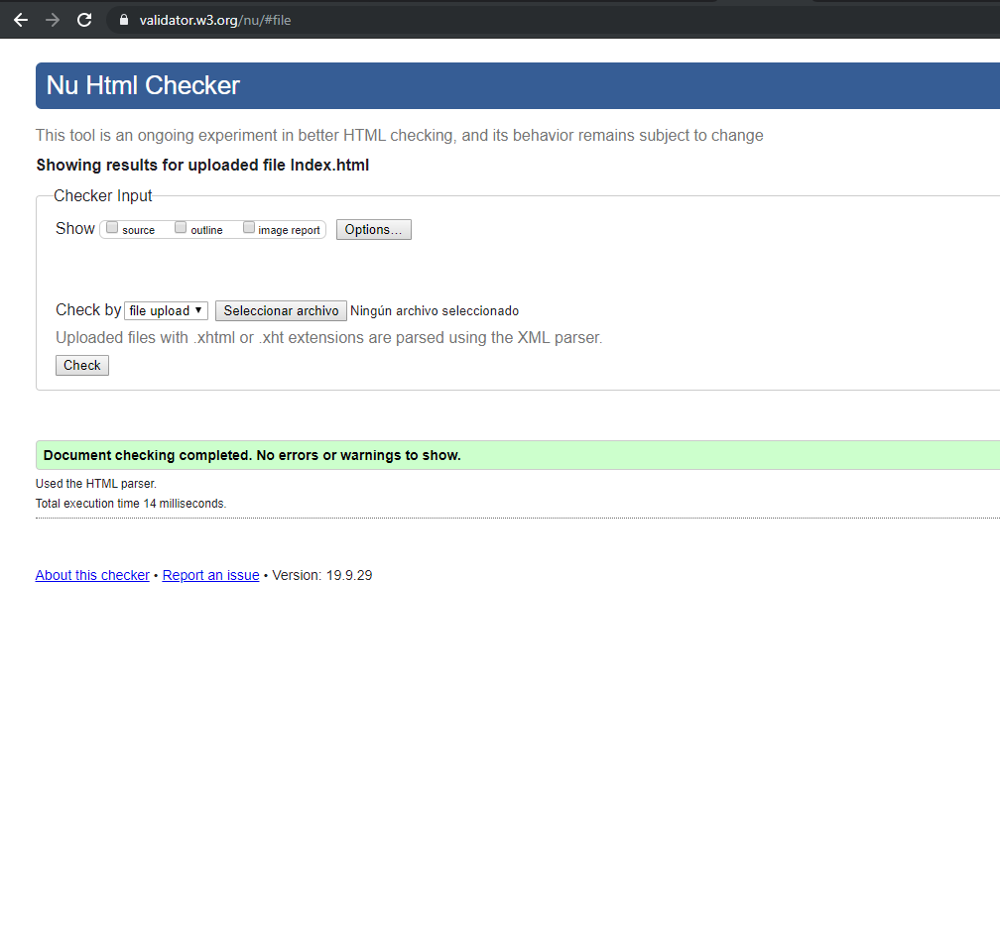
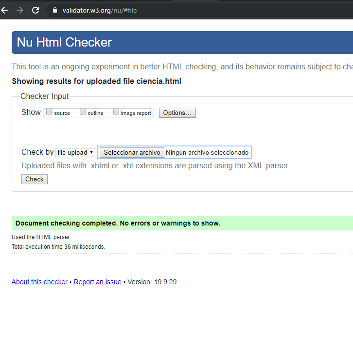
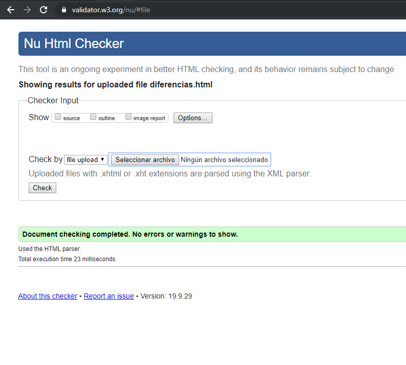
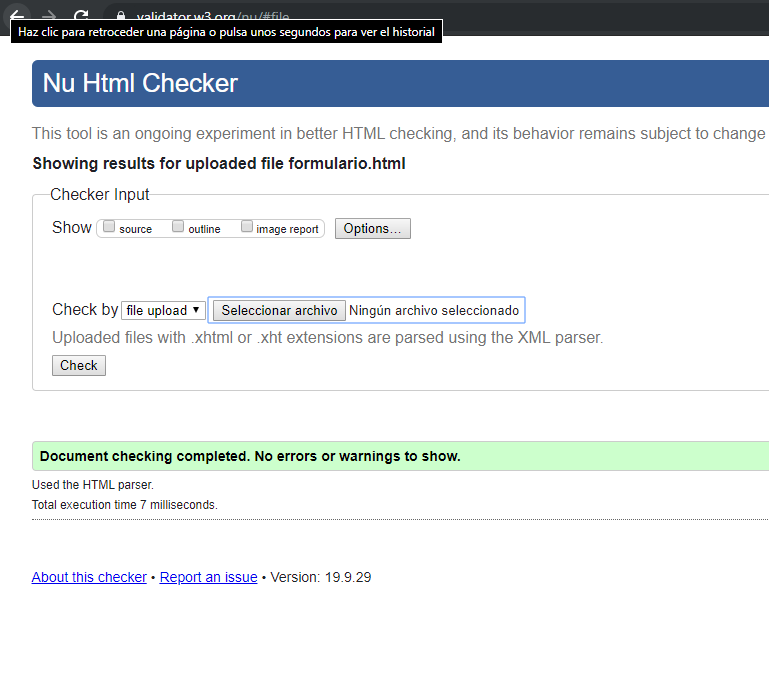
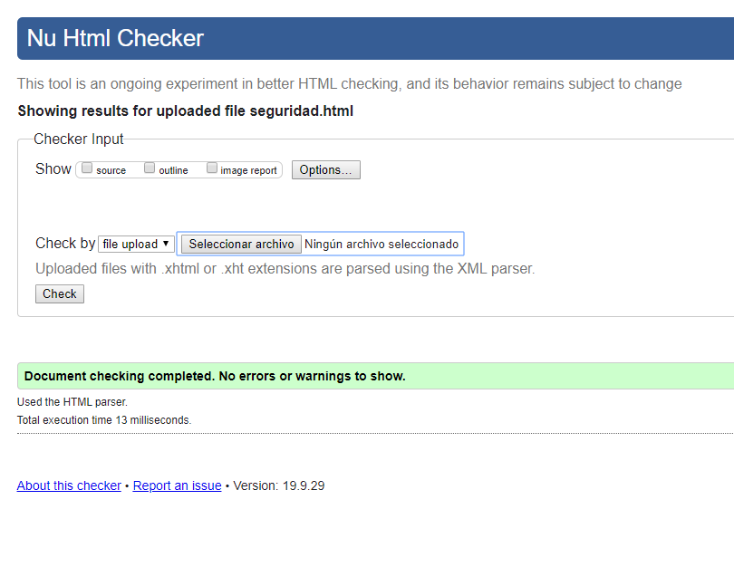

#Practica02--Mi-Sitio-Web-CSS-

D:\Archivos de programa (x86)\XAMPP\htdocs\Practica02_Mi_Stio_Web\media

1.Primero crear los directorios en donde vamos a guardas las imágenes, archivos css, archivos html.

2. Crear un repositorio en GitHub con el nombre “Practica02 – Mi Sitio Web (CSS)”.

2.2. Realizar un commit y push por cada requerimiento de los puntos antes descritos.

3.	Al finalizar la práctica se debe validar todas las páginas HTML y hojas de estilos CSS creadas usando el W3C Validator.
?	Index:

> Ciencia

> Diferencias

> Formulario

> Seguridad

* Dos_columnas

