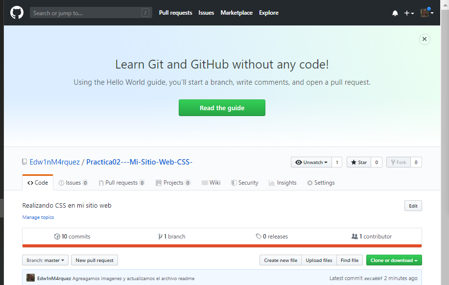

#Practica02--Mi-Sitio-Web-CSS-

1.Primero crear los directorios en donde vamos a guardas las imágenes, archivos css, archivos html.

2. Crear un repositorio en GitHub con el nombre “Practica02 – Mi Sitio Web (CSS)”.

2.2. Realizar un commit y push por cada requerimiento de los puntos antes descritos.

