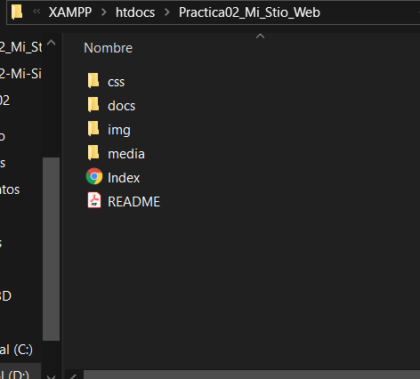
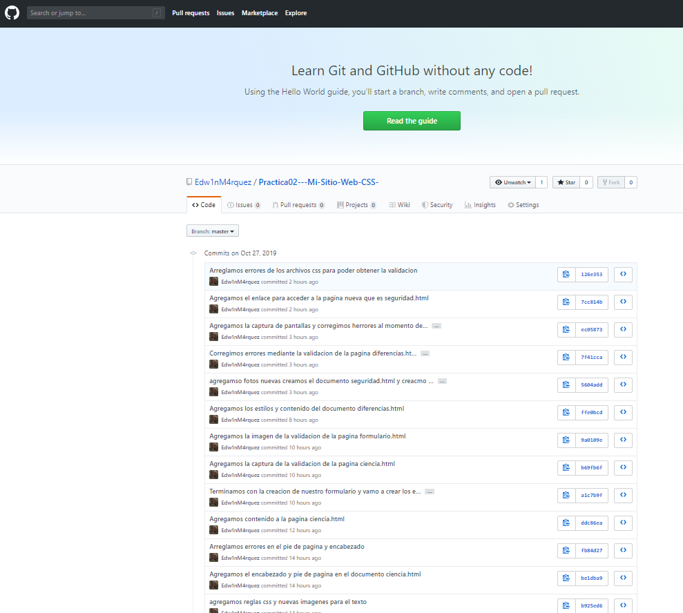

#Practica02--Mi-Sitio-Web-CSS-

D:\Archivos de programa (x86)\XAMPP\htdocs\Practica02_Mi_Stio_Web\media

1.Primero crear los directorios en donde vamos a guardas las imágenes, archivos css, archivos html.

2. Crear un repositorio en GitHub con el nombre “Practica02 – Mi Sitio Web (CSS)”.

2.2. Realizar un commit y push por cada requerimiento de los puntos antes descritos.

3.	Al finalizar la práctica se debe validar todas las páginas HTML y hojas de estilos CSS creadas usando el W3C Validator.
?	Index:

> Ciencia

> Diferencias

> Formulario

> Seguridad

* Dos_columnas

* Tres_columnas

* Reglas

* Reglas2
 

* Reglas3

* Reglas4

* Reglas5

4.	Luego, se debe crear el archivo README del repositorio de GitHub.

5.	Puntos requeridos para la práctica: 
Se pide realiza un sitio web que tenga al menos una página principal (index.html) y cinco páginas que tengan navegabilidad entre todas las páginas html. Además, se pide utilizar estilos CSS con la finalidad de obtener un diseño como el que se muestra a continuación, para cada uno de las páginas html. El tema elegido por cada estudiante deberá ser distinto al realizado en la práctica 01 – Creación de un sitio web usando HTML5.  

6.	Se recomienda utilizar, en al menos una página HTML, un diseño a dos columnas con cabecera y pie de página. Así, como también se recomienda utilizar, en al menos una página HTML, un diseño a tres columnas con cabecera y pie de.
-INDEX

- FORMULARIO 

- CIENCA

-DIFERENCIAS

- SEGURIDAD

7. De igual manera, se pide que se creé al menos tres archivos CSS, estos archivos estarán
almacenados en una carpeta llamada css. Un archivo será para el diseño a dos columnas, otro
archivo para el diseño a tres columnas, y los demás archivos será para las reglas CSS
relacionas a textos, colores, tablas, secciones, artículos, etc.

8. También, se pide que se utilice selectores por etiquetas, selectores descendentes, selectores por clase y selectores por id.

